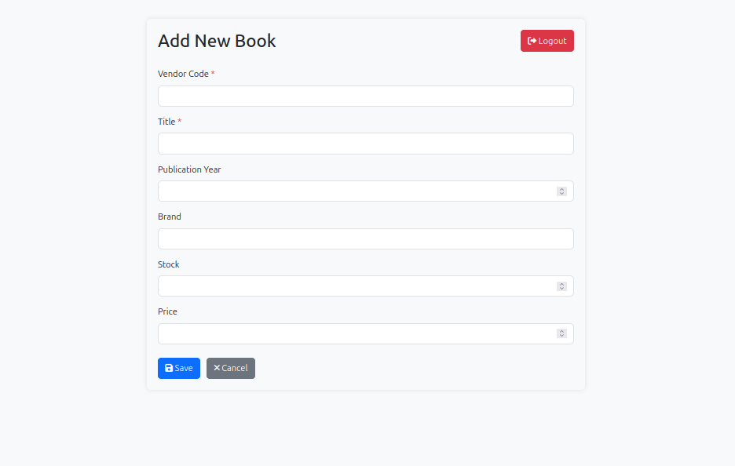
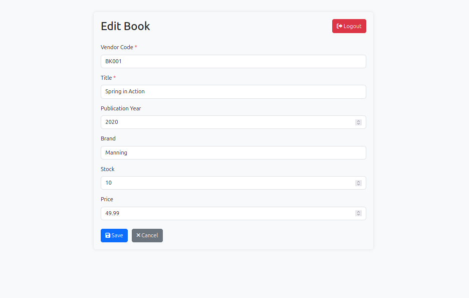

Разработать небольшой веб-сервис с авторизацией и возможностью управления списком книг.

1. Авторизация по логину и паролю (можно in-memory, без регистрации)
2. Добавлять, редактировать, удалять книги
3. Хранить поля: id, vendorCode, title, year, brand, stock, price. Все данные сохраняются в базу данных.
4. Выводить список книг в виде таблицы (Bootstrap+Thymeleaf)
5. Поддерживать пагинацию и фильтрацию по title, brand, year
6. REST API: GET /api/books, POST /api/books, PUT /api/books/{id}, DELETE /api/books/{id}

Приложение запускается на порту 8080
InMemory user details:

login: user

password: password

При успешном логине нас перекидывает на страницу со всеми книгами

фильтрация

пагинация

Создание новой книги

Редактирование книги

Удаление книги

